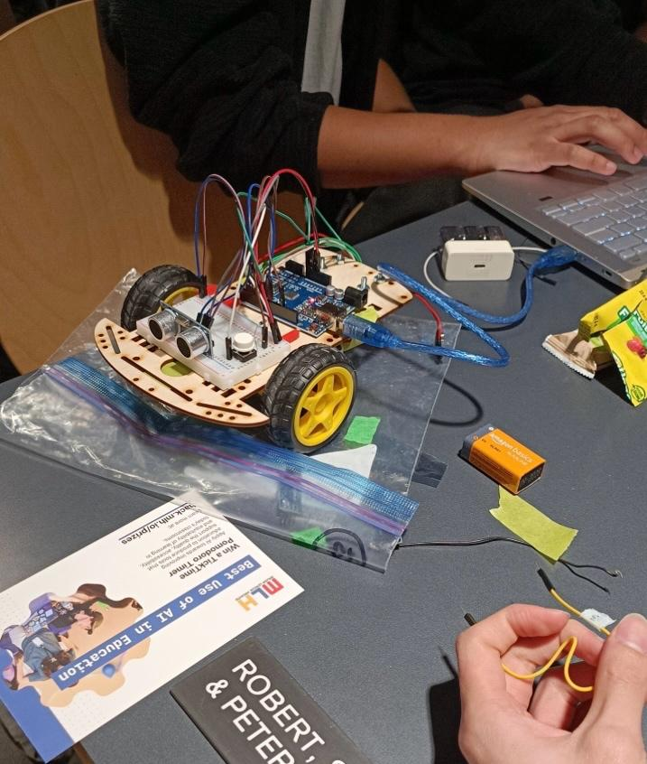
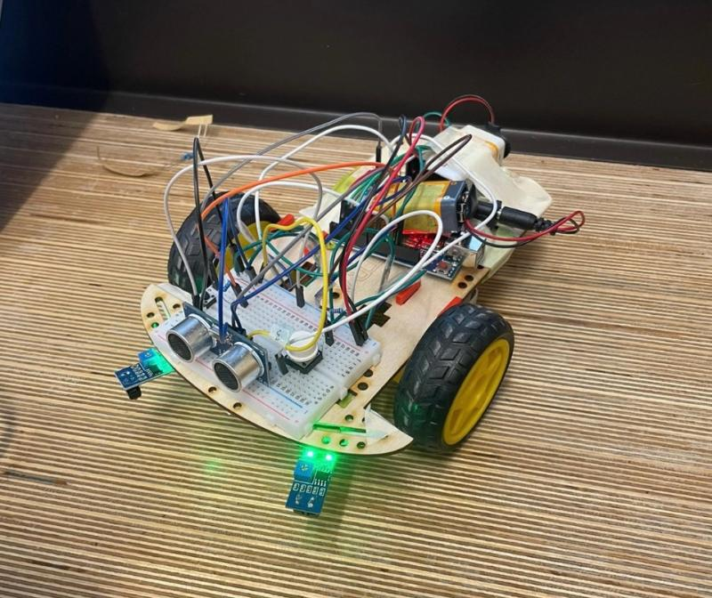

# 🚗 Autonomous Vehicle

An autonomous vehicle developed in 24 hours at UTRA Hacks (University of Toronto Robotics Association), using an Arduino UNO, two motors, and a combination of infrared and ultrasonic sensors. The vehicle successfully completed mini challenges such as line following and obstacle avoidance, with real-time navigation logic implemented in the Arduino IDE.

---

## 🛠 Hardware Components

- 🧠 **Microcontroller**: Arduino UNO  
- ⚙️ **Motors**: 2x DC motors with driver  
- 👀 **Sensors**:
  - 2x Infrared (IR) sensors (for line following)
  - 1x Ultrasonic sensor (for obstacle detection)

---

## 🚀 Features

### 🔁 Real-Time Navigation
- Autonomous control loop using Arduino IDE
- Processes sensor inputs in real-time to drive movement

### 🛣️ Line Following
- IR sensors detect black/white contrast
- Steering logic maintains alignment with line paths

### 🧱 Obstacle Avoidance
- Ultrasonic sensor continuously scans for objects
- Vehicle steers away from obstacles upon detection

---

## 👥 Team & Timeline

- 👨‍💻 Team Size: 4  
- 🕒 Built in: 24 hours  
- 🏫 Event: UTRA Hacks (University of Toronto Robotics Association)

---

## 📸 Media & Demo

---

## 🔗 Links

- 💻 **GitHub Repository**: [Autonomous Vehicle Project](https://github.com/nathwung/autonomous-vehicle)
